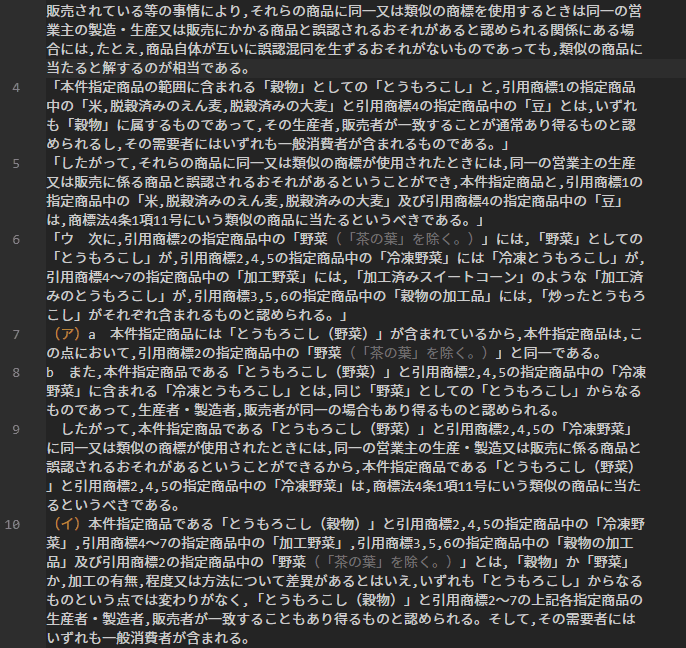

# textHenkan
日本語テキストの様々な変換をします

## 機能
選択範囲のテキスト（選択されていない場合は全範囲のテキスト）に対して、次の変換をします。
- toHankaku: 全角英数字・記号・スペースを半角に変換
- deleteKaigyo: 改行の削除
- deleteKaigyoSpace: 改行とスペースの削除
- commaToTouten: 「，」を「、」に変換
- toutenToComma: 「、」を「，」に変換
- doubleKakko: カギカッコ（「」）でくくられた文字列内のカギカッコをすべて二重カギカッコ（『』）に変換（「aa「bb」cc」→「aa『bb』cc」）
- toUpperCase: 半角アルファベットの小文字を大文字に変換
- toLowerCase: 半角アルファベットの大文字を小文字に変換

## 使い方
コマンドパレットで上記のコマンドを呼び出して実行するか、コンテキストメニュー（Windowsの右クリックメニュー）から選択して実行します（下画像参照）。

キーボードショートカットで実行したい場合は、下記のコマンドを適当なキーに割り当ててください。

- toHankaku
	- "texthenkan.toHankaku"
- deleteKaigyo
	- "texthenkan.deleteKaigyo"
- deleteKaigyoSpace
	- "texthenkan.deleteKaigyoSpace"
- commaToTouten
	- "texthenkan.commaToTouten"
- toutenToComma
	- "texthenkan.toutenToComma"
- doubleKakko
	- "texthenkan.doubleKakko"
- toUpperCase
	- "texthenkan.toUpperCase"
- toLowerCase
	- "texthenkan.toLowerCase"

## Release Notes

### 1.0.0

公開
